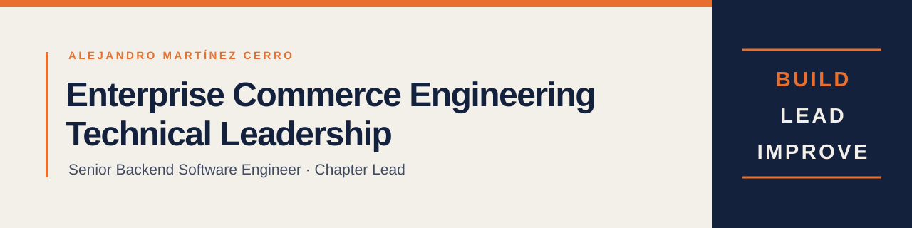

  

## About me

I build and evolve reliable enterprise commerce platforms, combining hands-on backend engineering with technical leadership.

I am a **Senior Backend Software Engineer and Chapter Lead at aspaNETCONOMY**, specializing in **SAP Commerce Cloud (Hybris)** and **SAP
Composable Storefront (Spartacus)**. My work covers the full delivery cycle: analyzing complex requirements, investigating critical areas,
implementing new capabilities, and helping ensure that solutions work correctly from both functional and technical perspectives.

As a Chapter Lead, I promote knowledge sharing, consistent engineering practices, and continuous improvement—while remaining an active
contributor within the development team.

## What I bring

- **Enterprise Commerce Engineering** — Building and extending SAP Commerce Cloud solutions for complex business domains.
- **Backend Development** — Developing maintainable services and integrations with Java and the Spring ecosystem.
- **Frontend Development** — Connecting commerce backends with Angular-based, server-rendered storefront experiences.
- **Technical Leadership** — Supporting engineers, spreading knowledge, and raising quality standards across teams.
- **Critical Problem-Solving** — Analyzing sensitive areas of a system and turning findings into robust implementations.

## Technology focus

  
  
  
  
  
  
  

| Area                   | Experience                                                                                            |
|------------------------|-------------------------------------------------------------------------------------------------------|
| **Commerce**           | SAP Commerce Cloud (Hybris), SAP Composable Storefront (Spartacus)                                    |
| **Backend**            | Java, Spring Boot, Spring MVC, REST, Spring Security, Spring Data JPA, Spring Integration, Spring AOP |
| **Frontend**           | TypeScript, Angular, server-side rendering                                                            |
| **Delivery & quality** | CI/CD, Docker, Jenkins, SonarQube, Git-based workflows                                                |
| **Collaboration**      | Technical leadership, mentoring, knowledge sharing, continuous improvement                            |

## Foundations and mentoring

I started my career with a Higher Technician qualification in Web Application Development, graduating with a **final grade of 9.46/10**, an
overall honors distinction, and ten subject-level distinctions.

Alongside product delivery, I have also supported the training of vocational education students—an experience that strengthened my interest
in mentoring and making technical knowledge accessible.

## Beyond engineering

Away from the keyboard, you will usually find me 🧗‍♂️ climbing, 🏔️ hiking, or 🎣 fishing.

## Connect

Visit my LinkedIn profile for a complete and up-to-date overview of my professional experience.

